# Architecture Stack-IA

<div align="center">


</div>

---

## Vue d'ensemble

Stack-IA est une architecture microservices complète pour l'intelligence artificielle locale, orchestrée via Docker Compose et Traefik.

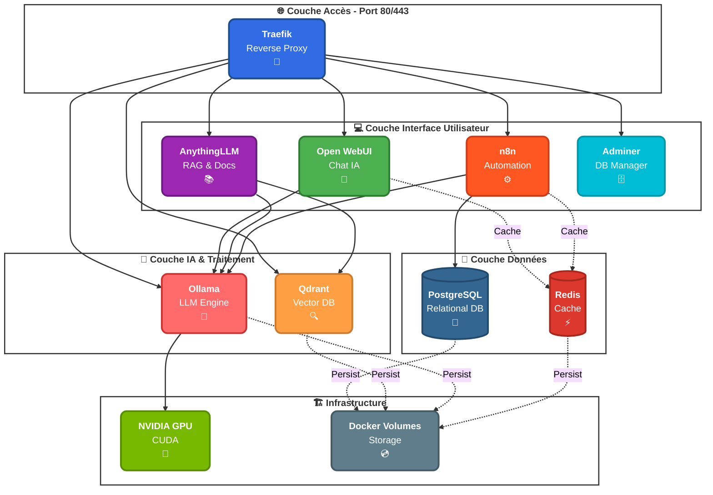

---

## Composants Principaux

### Couche Reverse Proxy

#### Traefik v2.10
**Rôle** : Point d'entrée unique pour tous les services

| Caractéristique | Valeur |
|----------------|--------|
| Port HTTP | 80 |
| Port HTTPS | 443 |
| Port Dashboard | 8081 |
| Discovery | Automatique via Docker labels |
| SSL | Let's Encrypt (optionnel) |
| Network | stack-ia-network (bridge) |

**Fonctionnalités** :
- Routage basé sur les noms de domaine
- Load balancing automatique
- Génération de certificats SSL
- Dashboard de monitoring temps réel
- Health checks automatiques

---

### Couche Intelligence Artificielle

#### Ollama
**Rôle** : Moteur d'inférence pour les modèles LLM

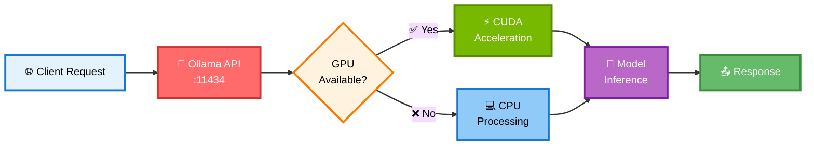

| Caractéristique | Valeur |
|----------------|--------|
| Port | 11434 |
| GPU Support | NVIDIA CUDA (optionnel) |
| Stockage modèles | `/root/.ollama` |
| Format API | REST JSON |
| Modèles supportés | Llama, Mistral, CodeLlama, etc. |

**Modèles recommandés** :
```
llama3.2        (8GB)  - Usage général
mistral         (4GB)  - Optimisé français
codellama       (4GB)  - Génération de code
nomic-embed-text(274MB)- Embeddings (RAG)
phi3            (2.3GB)- Léger et rapide
```

#### Qdrant
**Rôle** : Base de données vectorielle pour RAG (Retrieval Augmented Generation)

| Caractéristique | Valeur |
|----------------|--------|
| Port HTTP | 6333 |
| Port gRPC | 6334 |
| Stockage | `/qdrant/storage` |
| API | REST + gRPC |
| Dashboard | Intégré |

**Utilisation** :
- Stockage des embeddings de documents
- Recherche sémantique
- Similarité vectorielle
- Context enrichment pour LLM

---

### Couche Interface Utilisateur

#### Open WebUI
**Rôle** : Interface de chat moderne similaire à ChatGPT

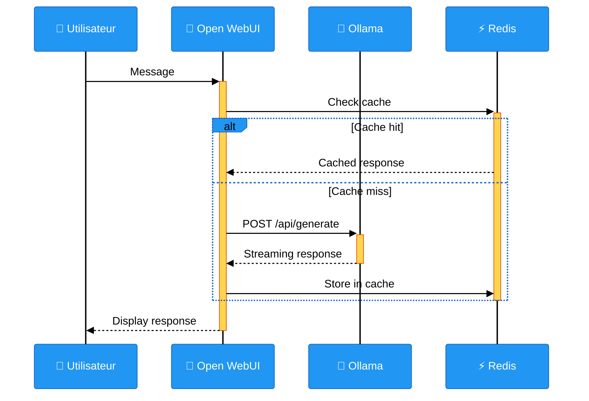

| Caractéristique | Valeur |
|----------------|--------|
| Port | 3000 (interne: 8080) |
| Authentification | Oui (WEBUI_AUTH) |
| Sessions | Stockées localement |
| Multi-utilisateurs | Oui |

#### AnythingLLM
**Rôle** : Plateforme RAG complète

**Architecture RAG** :
```
Document → Chunking → Embedding (Ollama) → Vector DB (Qdrant)
                                                     ↓
User Query → Embedding → Similarity Search → Context → LLM → Response
```

| Caractéristique | Valeur |
|----------------|--------|
| Port | 3001 |
| LLM Provider | Ollama |
| Embedding Engine | Ollama (nomic-embed-text) |
| Vector DB | Qdrant |
| Documents supportés | PDF, TXT, DOCX, MD, etc. |

**Flux de traitement** :
1. Upload de documents
2. Chunking intelligent
3. Génération d'embeddings
4. Stockage dans Qdrant
5. Requête utilisateur
6. Recherche vectorielle
7. Augmentation du contexte
8. Génération de réponse

#### n8n
**Rôle** : Plateforme d'automatisation no-code/low-code

| Caractéristique | Valeur |
|----------------|--------|
| Port | 5678 |
| Base de données | PostgreSQL |
| Encryption | AES-256 (N8N_ENCRYPTION_KEY) |
| Webhooks | Supportés |
| Timezone | Europe/Paris |

**Intégrations disponibles** :
- HTTP Request vers Ollama
- PostgreSQL
- Redis
- Webhooks
- 300+ nodes pré-configurés

---

### Couche Données

#### PostgreSQL 16 Alpine
**Rôle** : Base de données relationnelle principale

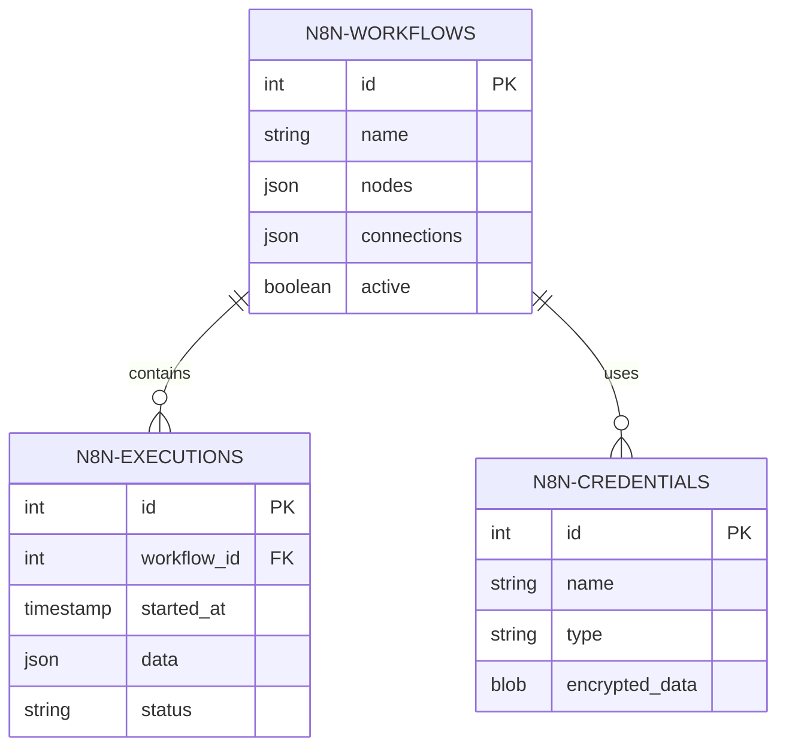

| Caractéristique | Valeur |
|----------------|--------|
| Port | 5432 |
| Version | 16-alpine |
| Users | stackia (admin), n8n (app) |
| Database | n8n |
| Health check | pg_isready |

#### Redis 7 Alpine
**Rôle** : Cache et stockage clé-valeur

| Caractéristique | Valeur |
|----------------|--------|
| Port | 6379 |
| Persistence | AOF (Append-Only File) |
| Max Memory | 512 MB |
| Eviction Policy | allkeys-lru |
| Health check | redis-cli ping |

**Cas d'usage** :
- Cache de sessions utilisateurs
- Cache de réponses LLM
- Files d'attente de tâches
- Rate limiting

---

## Architecture Réseau

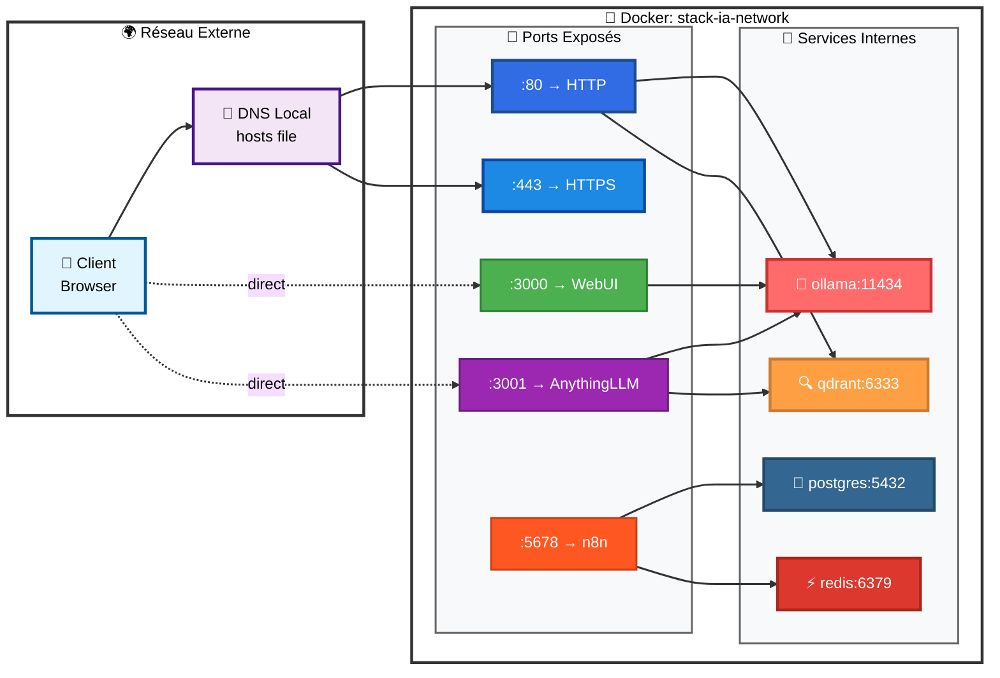

### Résolution DNS

**Externe (via /etc/hosts ou C:\Windows\System32\drivers\etc\hosts)** :
```
127.0.0.1    traefik.stack-ia.local
127.0.0.1    webui.stack-ia.local
127.0.0.1    n8n.stack-ia.local
127.0.0.1    anythingllm.stack-ia.local
127.0.0.1    qdrant.stack-ia.local
127.0.0.1    adminer.stack-ia.local
127.0.0.1    ollama.stack-ia.local
```

**Interne (Docker DNS)** :
- Chaque conteneur est accessible par son nom de service
- Exemple : `http://ollama:11434` depuis n8n
- Exemple : `http://postgres:5432` depuis n8n
- Résolution automatique via le réseau bridge

---

## Persistance des Données

```mermaid
%%{init: {'theme':'base', 'themeVariables': {'background':'#fff3e0','mainBkg':'#fff3e0','primaryTextColor':'#000','secondaryTextColor':'#000','tertiaryTextColor':'#000','lineColor':'#000','textColor':'#000'}}}%%
graph TB
    subgraph VOLUMES["💿 Docker Volumes"]
        direction TB
        V1["🔒 traefik_letsencrypt<br/>Certificats SSL"]
        V2["📋 traefik_logs<br/>Logs"]
        V3["🦙 ollama_data<br/>Modèles LLM"]
        V4["💬 webui_data<br/>Sessions"]
        V5["🐘 postgres_data<br/>Database"]
        V6["⚙️ n8n_data<br/>Workflows"]
        V7["📚 anythingllm_data<br/>Configs"]
        V8["📄 anythingllm_docs<br/>Documents"]
        V9["📤 anythingllm_out<br/>Outputs"]
        V10["🔍 qdrant_data<br/>Vectors"]
        V11["⚡ redis_data<br/>Cache"]
    end
    
    subgraph HOST["🗄️ Système Hôte"]
        PHYSICAL["/var/lib/docker/volumes/"]
    end
    
    V1 -.-> PHYSICAL
    V2 -.-> PHYSICAL
    V3 ==> PHYSICAL
    V4 -.-> PHYSICAL
    V5 ==> PHYSICAL
    V6 ==> PHYSICAL
    V7 -.-> PHYSICAL
    V8 ==> PHYSICAL
    V9 -.-> PHYSICAL
    V10 ==> PHYSICAL
    V11 ==> PHYSICAL
    
    style V1 fill:#9C27B0,stroke:#6a1b7f,stroke-width:2px,color:#fff
    style V2 fill:#607D8B,stroke:#455a64,stroke-width:2px,color:#fff
    style V3 fill:#ff6b6b,stroke:#cc3333,stroke-width:3px,color:#fff
    style V4 fill:#4CAF50,stroke:#2e7d32,stroke-width:2px,color:#fff
    style V5 fill:#336791,stroke:#234a6d,stroke-width:3px,color:#fff
    style V6 fill:#FF5722,stroke:#cc3d18,stroke-width:3px,color:#fff
    style V7 fill:#9C27B0,stroke:#6a1b7f,stroke-width:2px,color:#fff
    style V8 fill:#795548,stroke:#4e342e,stroke-width:3px,color:#fff
    style V9 fill:#9E9E9E,stroke:#616161,stroke-width:2px,color:#fff
    style V10 fill:#ff9f43,stroke:#cc7a2e,stroke-width:3px,color:#fff
    style V11 fill:#dc382d,stroke:#a82820,stroke-width:3px,color:#fff
    style PHYSICAL fill:#263238,stroke:#000,stroke-width:3px,color:#fff
    style VOLUMES fill:#ffffff,stroke:#333,stroke-width:3px
    style HOST fill:#ffffff,stroke:#333,stroke-width:3px
    
    linkStyle default stroke:#333,stroke-width:2px
```

### Espace disque typique

| Volume | Taille estimée | Croissance |
|--------|---------------|------------|
| ollama_data | 5-50 GB | Par modèle téléchargé |
| postgres_data | 100-500 MB | Workflows & executions |
| qdrant_data | 1-10 GB | Documents indexés |
| anythingllm_documents | 1-100 GB | Documents uploadés |
| redis_data | 50-512 MB | Cache (limité) |
| Autres | < 1 GB | Configuration |

---

## Flux de Données

### Scénario 1 : Chat Simple (Open WebUI)

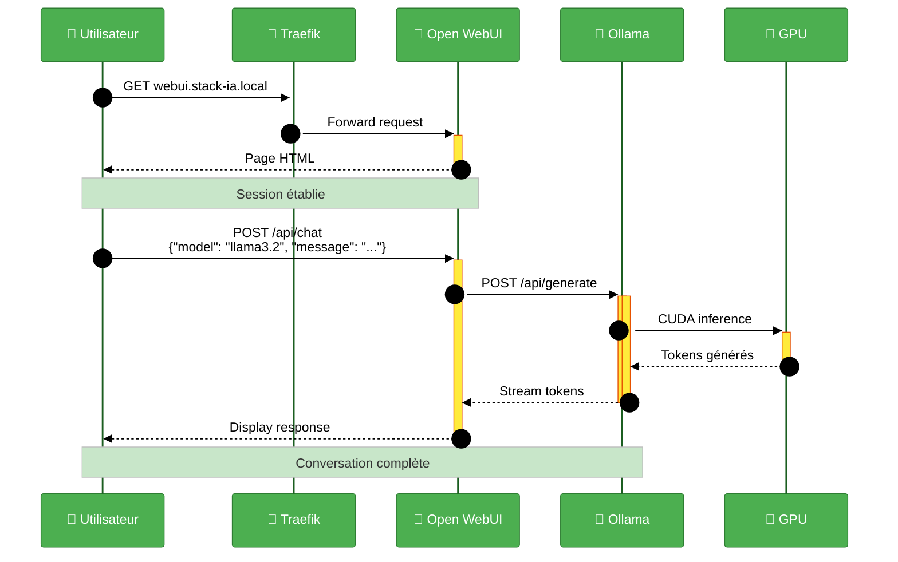

### Scénario 2 : RAG avec AnythingLLM

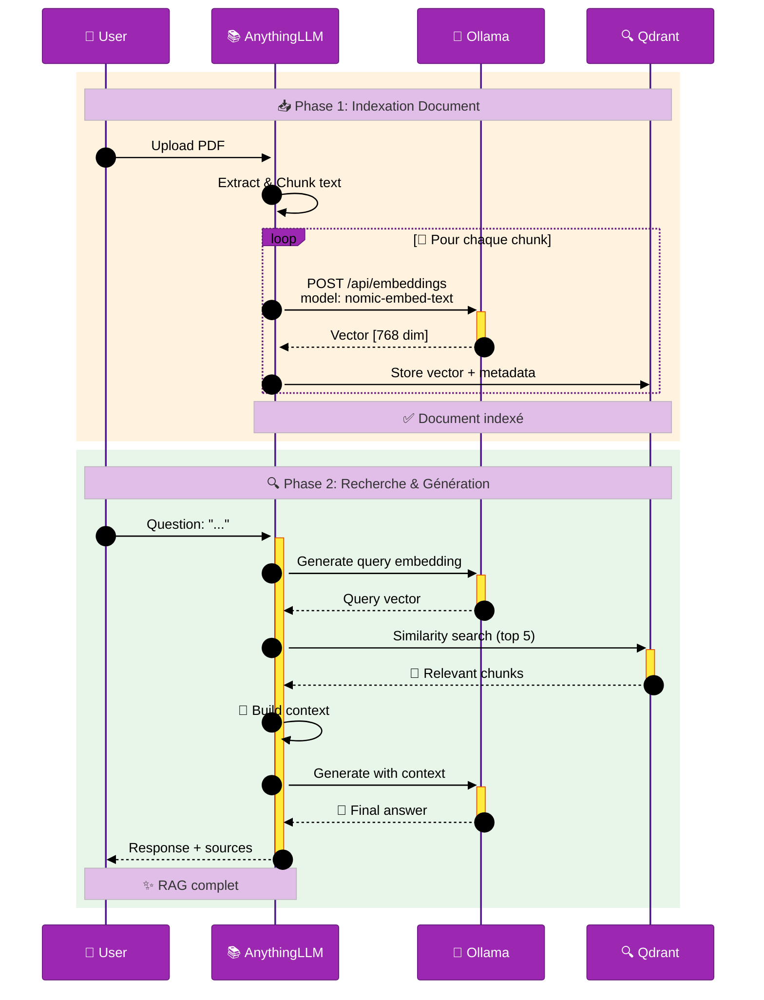

### Scénario 3 : Workflow n8n

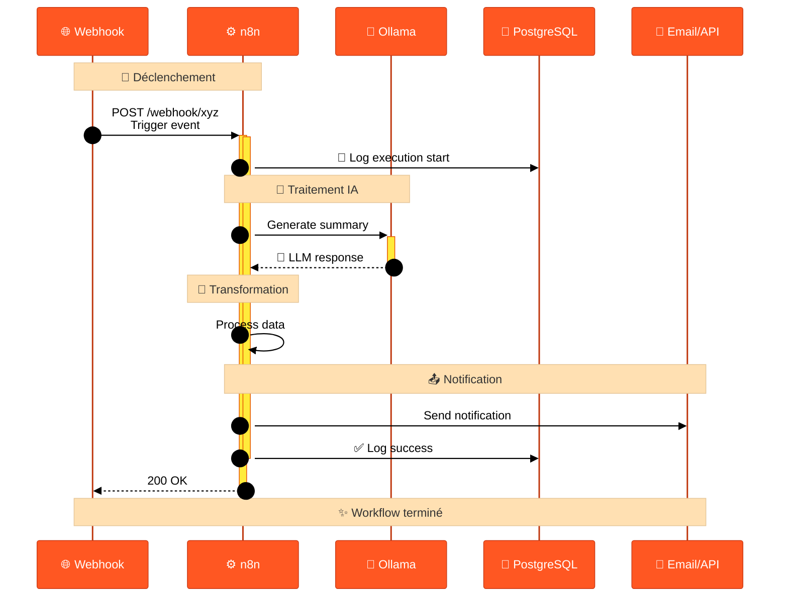

---

## Stack Technique

### Technologies Principales

| Composant | Technologie | Version | Langage |
|-----------|-------------|---------|---------|
| Reverse Proxy | Traefik | 2.10 | Go |
| LLM Engine | Ollama | latest | Go |
| Chat UI | Open WebUI | main | Python/Svelte |
| RAG Platform | AnythingLLM | latest | Node.js/React |
| Automation | n8n | latest | Node.js/Vue |
| Vector DB | Qdrant | latest | Rust |
| Relational DB | PostgreSQL | 16-alpine | C |
| Cache | Redis | 7-alpine | C |
| DB Admin | Adminer | latest | PHP |

### Orchestration

```yaml
Docker Compose v3.8
├── Services: 9
├── Volumes: 11
├── Networks: 1 (bridge)
└── Deployment: docker compose up -d
```

---

## Patterns & Bonnes Pratiques

### 1. Microservices Architecture
Chaque service est isolé, scalable indépendamment, et communique via APIs REST.

### 2. Reverse Proxy Pattern
Traefik comme single entry point avec routing dynamique.

### 3. Service Discovery
Découverte automatique via labels Docker - pas de configuration manuelle.

### 4. Health Checks
```yaml
healthcheck:
  test: ["CMD-SHELL", "pg_isready -U stackia"]
  interval: 10s
  timeout: 5s
  retries: 5
```

### 5. Separation of Concerns
- **Presentation** : Open WebUI, AnythingLLM, n8n UI
- **Business Logic** : n8n workflows, AnythingLLM RAG
- **Data** : PostgreSQL, Qdrant, Redis
- **Infrastructure** : Traefik, Docker

### 6. Configuration Externe
Toutes les configurations sensibles dans `.env`, jamais hardcodées.

### 7. Volumes Named
Persistance explicite avec volumes nommés pour faciliter backup/restore.

---

## Sécurité

### Authentification

| Service | Auth Méthode | Default |
|---------|--------------|---------|
| Open WebUI | Local users | Premier = admin |
| AnythingLLM | Local users | Workspace-based |
| n8n | Local users | Premier = owner |
| Adminer | PostgreSQL creds | Aucun user par défaut |
| Traefik Dashboard | None | Accessible localement |

### Encryption

```
├── n8n credentials : AES-256 (N8N_ENCRYPTION_KEY)
├── Open WebUI sessions : WEBUI_SECRET_KEY
├── PostgreSQL password : Plain text (docker network isolé)
└── Traefik SSL : Let's Encrypt (optionnel)
```

### Réseau

- Réseau Docker bridge isolé
- Pas d'exposition directe des DBs (postgres, redis)
- Firewall au niveau de l'hôte recommandé
- Traefik comme seul point d'entrée

---

## Scalabilité

### Horizontale (Future)

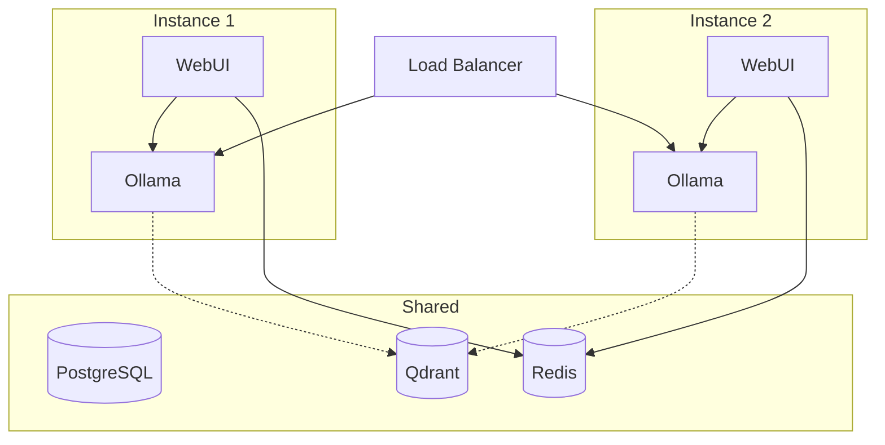

### Verticale (Actuelle)

- Augmenter RAM Docker : Settings → Resources → Memory
- Ajouter GPU plus puissant
- Utiliser SSD pour volumes
- Augmenter `max_memory` Redis si besoin

---

## Monitoring & Observabilité

### Logs

```bash
# Tous les services
docker compose logs -f

# Service spécifique
docker compose logs -f ollama

# Avec timestamps
docker compose logs -f --timestamps
```

### Métriques

```bash
# Ressources temps réel
docker stats

# Espace disque
docker system df -v

# Santé des services
docker compose ps
```

### Traefik Dashboard

Accès : `http://traefik.stack-ia.local` ou `http://localhost:8081`

Informations disponibles :
- Services actifs
- Routes configurées
- Middlewares appliqués
- Santé des backends
- Métriques HTTP

---

## Évolutions Futures

### Court terme
- [ ] Ajout de Prometheus + Grafana pour métriques
- [ ] Backup automatisé des volumes
- [ ] SSL Let's Encrypt en production
- [ ] Authentication centralisée (OAuth2)

### Moyen terme
- [ ] Kubernetes migration
- [ ] Multi-GPU support
- [ ] Model serving distribué
- [ ] CI/CD pipeline

### Long terme
- [ ] Multi-région deployment
- [ ] Auto-scaling basé sur charge
- [ ] ML Ops pipeline complet
- [ ] Fine-tuning infrastructure

---

## Vue Système Complète

### Diagramme 1 : Flux Utilisateur vers Services

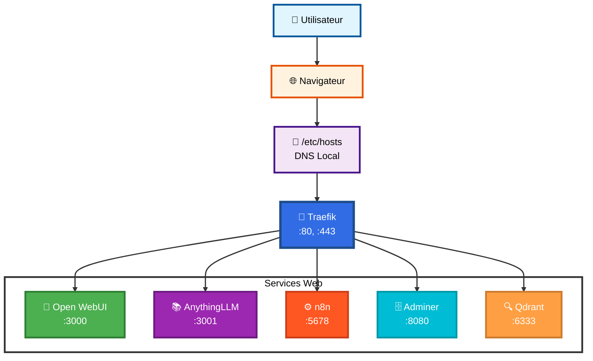

### Diagramme 2 : Communication Backend

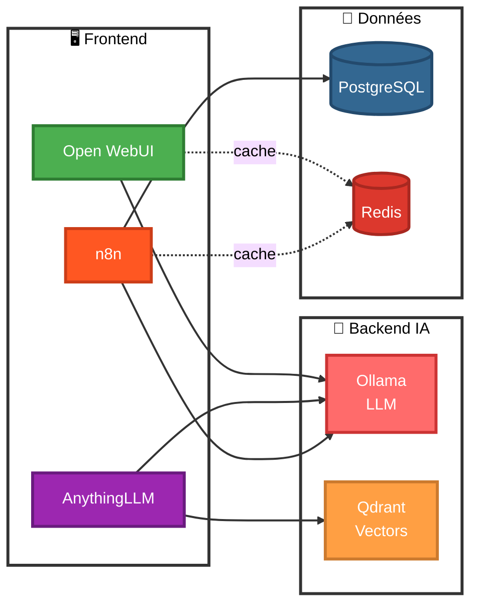

### Diagramme 3 : Infrastructure & Persistance

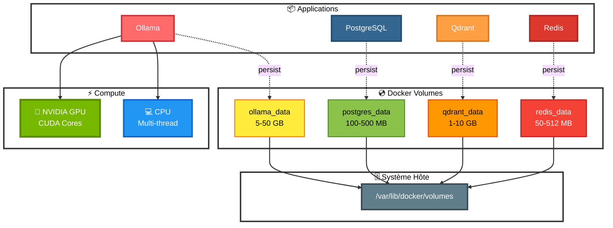

### Diagramme 4 : Architecture Réseau Docker

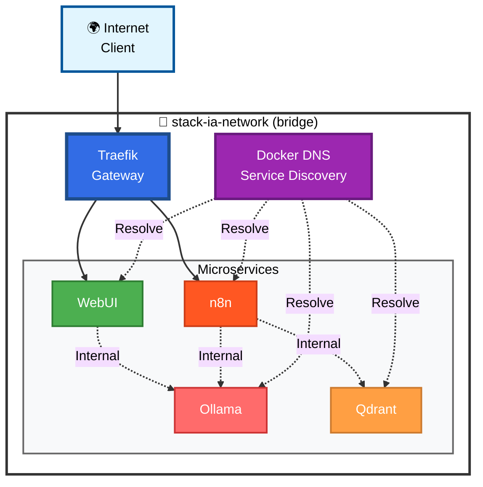

---

## Références

- [Docker Compose Documentation](https://docs.docker.com/compose/)
- [Traefik Documentation](https://doc.traefik.io/traefik/)
- [Ollama Documentation](https://github.com/ollama/ollama)
- [Qdrant Documentation](https://qdrant.tech/documentation/)
- [n8n Documentation](https://docs.n8n.io/)

---

**Dernière mise à jour** : 2025-01-06  
**Version** : 1.0  
**Auteur** : Stack-IA Project

