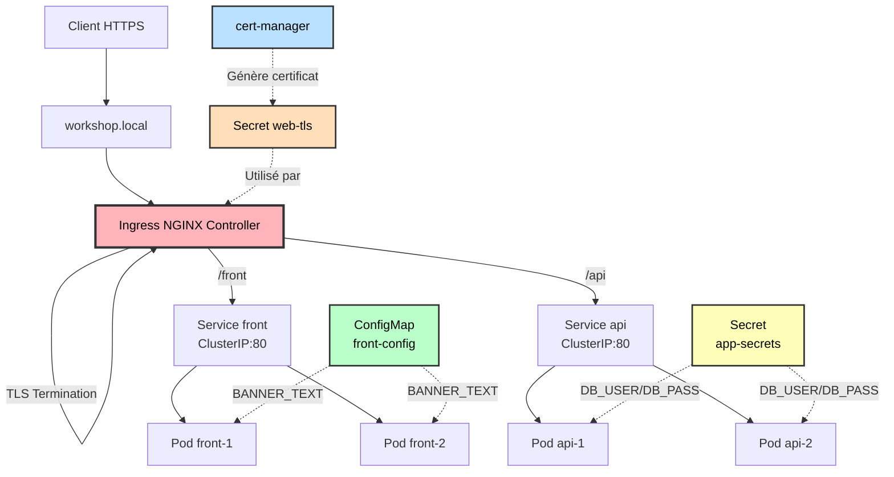

# TP S4 — Ingress, TLS, Config & Secrets

Déploiement d'applications web avec Ingress NGINX, gestion TLS via cert-manager, et injection de configuration via ConfigMaps et Secrets.

## Description

Ce projet démontre la mise en œuvre d'une architecture microservices sur Kubernetes avec :
- Exposition de services via Ingress Controller (routage L7)
- Sécurisation TLS avec certificats auto-signés (cert-manager)
- Gestion de configuration non sensible (ConfigMap)
- Gestion de données sensibles (Secret)
- Stratégie de rollback pour les déploiements

## Architecture

### Vue d'ensemble



**Pour plus de détails** : Voir [ARCHITECTURE.md](ARCHITECTURE.md) (diagrammes de séquence, flux L7, comparaisons L4/L7, stratégie de rollback).

### Composants déployés

- **Front** : Application NGINX de démonstration (nginxdemos/hello)
- **API** : Service HTTP de test (kennethreitz/httpbin)
- **Ingress Controller** : NGINX Ingress Controller
- **cert-manager** : Gestionnaire automatique de certificats TLS
- **ClusterIssuer** : Émetteur de certificats auto-signés

## Prérequis

- Cluster Kubernetes (kind / minikube / k3d ou managé)
- kubectl
- Ingress NGINX Controller installé
- cert-manager installé

## Déploiement rapide

### Option A : Utiliser le script automatique

```bash
./deploy.sh
```

Le script s'occupe de tout : namespace, configmap, secrets, applications, ingress.

### Option B : Déploiement manuel

#### 1. Créer le cluster (exemple avec kind)

```bash
kind create cluster --name workshop
```

#### 2. Installer les dépendances

```bash
# Ingress NGINX Controller
kubectl apply -f https://raw.githubusercontent.com/kubernetes/ingress-nginx/main/deploy/static/provider/kind/deploy.yaml

# cert-manager
kubectl apply -f https://github.com/cert-manager/cert-manager/releases/download/v1.13.2/cert-manager.yaml

# Attendre que les controllers soient prêts
kubectl wait --namespace ingress-nginx --for=condition=ready pod --selector=app.kubernetes.io/component=controller --timeout=120s
kubectl wait --namespace cert-manager --for=condition=ready pod --selector=app.kubernetes.io/instance=cert-manager --timeout=120s
```

#### 3. Déployer l'application

```bash
kubectl apply -f namespaces.yaml
kubectl apply -f configmap.yaml
kubectl apply -f secrets.yaml
kubectl apply -f certmanager.yaml
kubectl apply -f front.yaml
kubectl apply -f api.yaml
kubectl apply -f ingress.yaml

# Attendre que les pods soient prêts
kubectl wait --for=condition=ready pod -n workshop --all --timeout=120s
```

## Accès

Ajouter `127.0.0.1 workshop.local` dans votre fichier hosts :
- **Linux/Mac** : `/etc/hosts`
- **Windows** : `C:\Windows\System32\drivers\etc\hosts`

Accès HTTP :
- Front : http://workshop.local:8080/front
- API : http://workshop.local:8080/api/headers

Accès HTTPS :
- Front : https://workshop.local:8443/front
- API : https://workshop.local:8443/api/headers

Note : Accepter le certificat auto-signé dans le navigateur.

## Structure du projet

### Manifests Kubernetes

- `namespaces.yaml` - Namespace workshop
- `configmap.yaml` - Configuration non sensible (BANNER_TEXT)
- `secrets.yaml` - Credentials (DB_USER, DB_PASS)
- `certmanager.yaml` - ClusterIssuer self-signed
- `front.yaml` - Deployment + Service front
- `api.yaml` - Deployment + Service api
- `ingress.yaml` - Ingress avec routage L7 et TLS

### Scripts

- `deploy.sh` - Déploiement automatique (installe kind/kubectl/helm si nécessaire)
- `cleanup.sh` - Suppression des ressources

### Documentation

- `INSTALL.md` - Instructions détaillées d'installation et configuration
- `ARCHITECTURE.md` - Diagrammes techniques et flux L7

## Ressources injectées

### ConfigMap (front-config)
```yaml
BANNER_TEXT: "Hello M2 IR"
```

### Secret (app-secrets)
```yaml
DB_USER: app
DB_PASS: changeMe123
```

Les variables sont injectées dans les pods via `valueFrom` (configMapKeyRef / secretKeyRef).

## Tests de rollback

Simuler un déploiement défectueux :
```bash
kubectl set image deployment/front front=nginx:broken -n workshop
kubectl rollout status deployment/front -n workshop
```

Effectuer le rollback :
```bash
kubectl rollout undo deployment/front -n workshop
kubectl rollout status deployment/front -n workshop
```

## Vérifications

```bash
# État des ressources
kubectl get all -n workshop

# Certificat TLS
kubectl get certificate,secret -n workshop

# Logs Ingress
kubectl logs -n ingress-nginx -l app.kubernetes.io/component=controller --tail=50

# Tests
curl -k https://workshop.local:8443/front
curl -k https://workshop.local:8443/api/headers
```

## Livrables

- Manifests Kubernetes fonctionnels
- Ingress avec TLS opérationnel
- ConfigMap et Secret configurés
- Diagramme d'architecture (ARCHITECTURE.md)
- Documentation technique complète

## Nettoyage

```bash
# Supprimer le namespace
kubectl delete namespace workshop

# Supprimer le cluster kind
kind delete cluster --name workshop
```

## Documentation

- **INSTALL.md** : Instructions d'installation et configuration
- **ARCHITECTURE.md** : Diagrammes et explications techniques

## Évaluation (10 pts)

- Ingress + TLS : 4 pts
- Config/Secret : 3 pts
- Rollback démontré : 2 pts
- Documentation : 1 pt

## Auteur

TP S4 - M2 IR - Ingress, TLS, Config & Secrets
