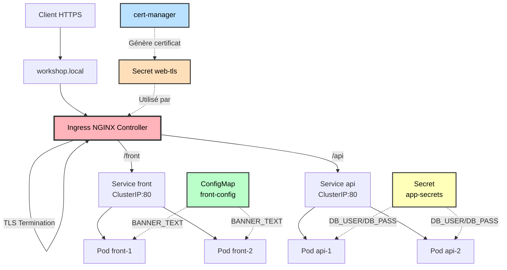
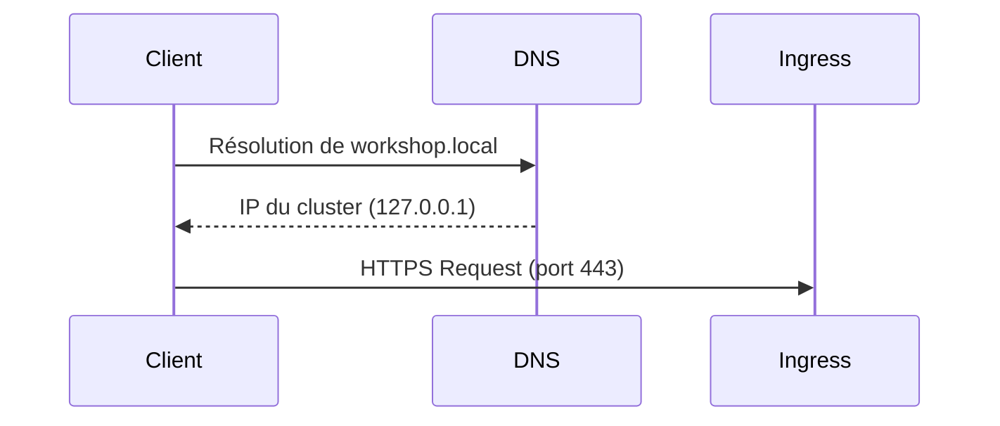
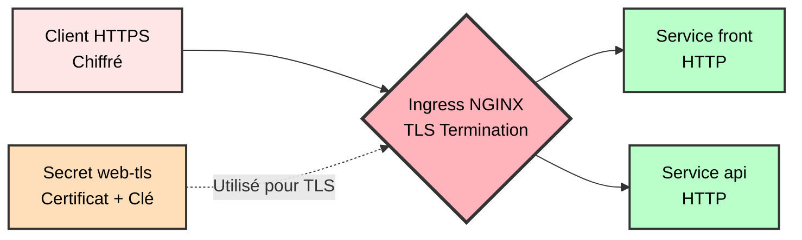
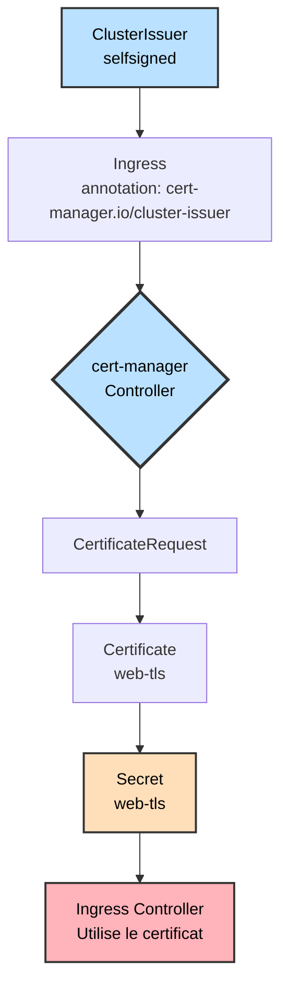
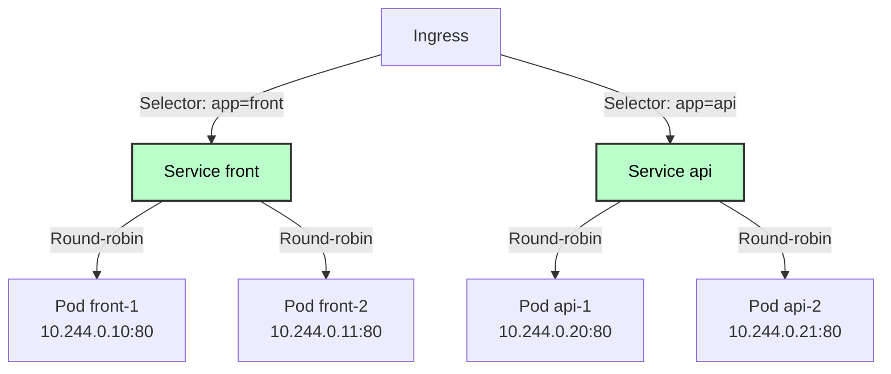
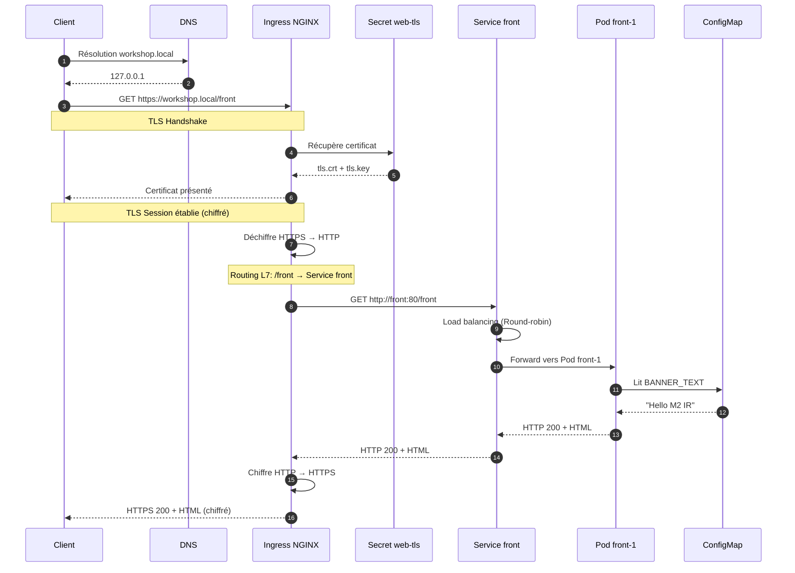
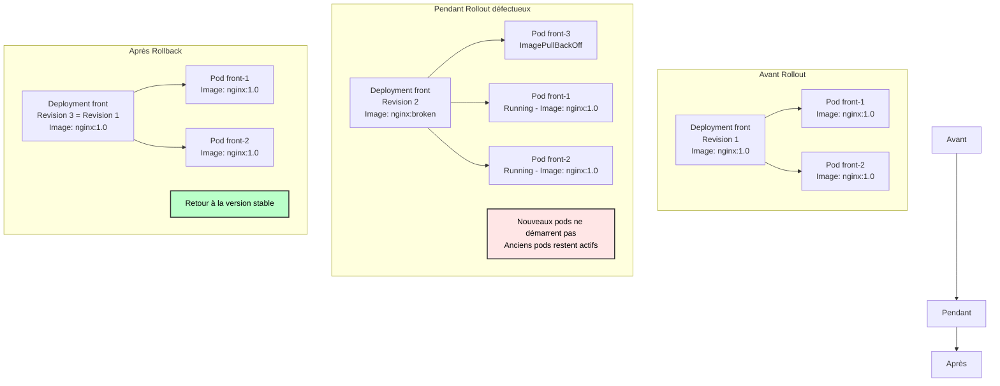
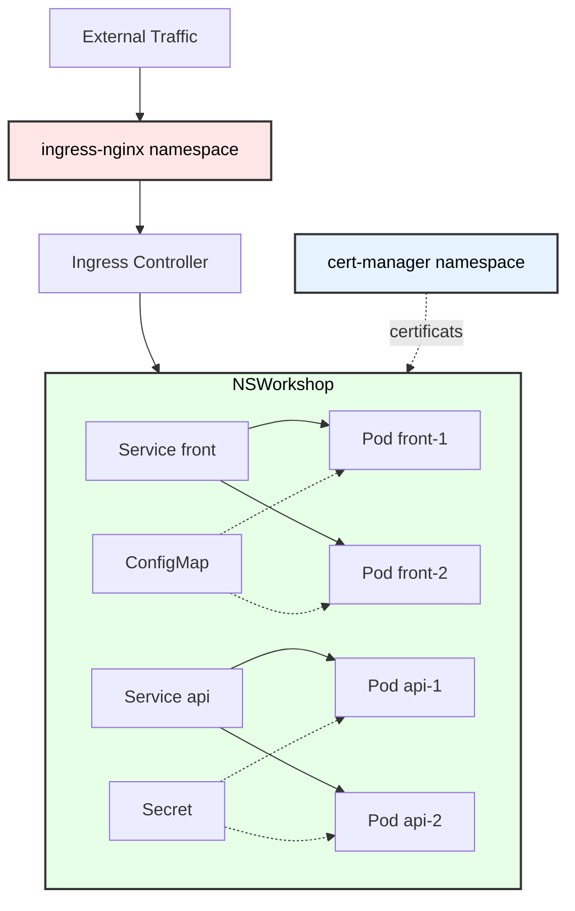

# Architecture du TP S4 — Flux L7 avec Ingress et TLS

## Diagramme général



---

## Détail des composants

### 1. Client & DNS



**Explication :**
- Le client résout `workshop.local` via le fichier `/etc/hosts`
- La requête HTTPS est envoyée vers l'Ingress Controller
- Port 443 pour HTTPS (ou 8443 si port-forward)

---

### 2. Ingress Controller — Terminaison TLS (L7)



**Explication :**
- L'Ingress Controller **termine le TLS** (déchiffre HTTPS → HTTP)
- Le trafic entre Ingress et Services est en **HTTP clair** (interne au cluster)
- Le certificat provient du Secret `web-tls` créé par cert-manager

**Règles de routage (Layer 7) :**
```yaml
Host: workshop.local
  ├── /front → Service front:80
  └── /api   → Service api:80
```

---

### 3. Cert-manager — Gestion automatique des certificats



**Processus :**
1. L'Ingress a une annotation `cert-manager.io/cluster-issuer: selfsigned`
2. Cert-manager détecte cette annotation
3. Il crée une `CertificateRequest` automatiquement
4. Le ClusterIssuer `selfsigned` génère un certificat auto-signé
5. Le certificat est stocké dans le Secret `web-tls`
6. L'Ingress utilise ce Secret pour le TLS

**Vérification :**
```bash
kubectl get certificate,certificaterequest,secret -n workshop
```

---

### 4. Services et Load Balancing



**Explication :**
- Les Services utilisent des **selectors** pour trouver les pods (`app: front`, `app: api`)
- Le trafic est **load-balancé** entre les pods (Round-robin par défaut)
- Type de Service : **ClusterIP** (interne uniquement, pas exposé à l'extérieur)

---

### 5. ConfigMap & Secret — Injection dans les Pods

```mermaid
flowchart LR
    CM[ConfigMap<br/>front-config<br/>BANNER_TEXT: "Hello M2 IR"] -.valueFrom.-> PF[Pod front<br/>ENV: BANNER_TEXT]
    
    S[Secret<br/>app-secrets<br/>DB_USER: app<br/>DB_PASS: changeMe123] -.secretKeyRef.-> PA[Pod api<br/>ENV: DB_USER, DB_PASS]
    
    style CM fill:#baffc9,stroke:#333,stroke-width:2px,color:#000
    style S fill:#ffffba,stroke:#333,stroke-width:2px,color:#000
    style PF fill:#fff,stroke:#333,stroke-width:2px,color:#000
    style PA fill:#fff,stroke:#333,stroke-width:2px,color:#000
```

**ConfigMap (données non sensibles) :**
```yaml
env:
  - name: BANNER_TEXT
    valueFrom:
      configMapKeyRef:
        name: front-config
        key: BANNER_TEXT
```

**Secret (données sensibles) :**
```yaml
env:
  - name: DB_USER
    valueFrom:
      secretKeyRef:
        name: app-secrets
        key: DB_USER
```

**Différences clés :**
- **ConfigMap** : Données lisibles en clair dans `kubectl get`
- **Secret** : Données encodées base64, accès contrôlé par RBAC

---

## Flux de requête complet



**Points clés :**
1. **TLS Termination** : Le chiffrement s'arrête à l'Ingress
2. **Routing L7** : L'Ingress analyse le path HTTP (pas juste IP:PORT)
3. **Load Balancing** : Le Service répartit entre les pods
4. **Injection Config** : Le pod lit les variables du ConfigMap au démarrage

---

## Comparaison Ingress (L7) vs Service (L4)

| Aspect | Service LoadBalancer (L4) | Ingress (L7) |
|--------|---------------------------|--------------|
| **Layer OSI** | Transport (TCP/UDP) | Application (HTTP/HTTPS) |
| **Routage** | Par IP:PORT uniquement | Par Host + Path |
| **TLS** | Géré par l'application | Terminaison au niveau Ingress |
| **Coût Cloud** | 1 IP publique par service | 1 IP pour tous les services |
| **Exemple** | `myapp.com:8080` → Service | `myapp.com/front`, `myapp.com/api` |

**Exemple de routage L7 :**
```
https://workshop.local/front → Service front
https://workshop.local/api   → Service api
https://workshop.local/admin → Service admin

Avec 1 seule IP publique !
```

**Exemple de routage L4 :**
```
https://front.workshop.local:443   → Service front (IP 1)
https://api.workshop.local:443     → Service api (IP 2)
https://admin.workshop.local:443   → Service admin (IP 3)

3 IP publiques nécessaires
```

---

## Stratégie de déploiement et Rollback



**Commandes :**
```bash
# Déploiement défectueux
kubectl set image deployment/front front=nginx:broken -n workshop

# Rollback immédiat
kubectl rollout undo deployment/front -n workshop

# Rollback vers une révision spécifique
kubectl rollout undo deployment/front -n workshop --to-revision=1
```

**Stratégie RollingUpdate (par défaut) :**
- Kubernetes remplace les pods **progressivement**
- Si les nouveaux pods échouent, les anciens **restent actifs**
- **Zero downtime** dans la plupart des cas

---

## Isolation et sécurité



**Points de sécurité :**

1. **Namespace isolation** : Les ressources sont isolées dans `workshop`
2. **Secret base64** : Les credentials sont encodés (pas chiffrés !)
3. **TLS termination** : Le trafic externe est chiffré
4. **ClusterIP** : Les services ne sont pas exposés à l'extérieur
5. **RBAC** : L'accès aux Secrets peut être contrôlé (non configuré dans ce TP)

**Important en production :**
- Utiliser **Sealed Secrets** ou **External Secrets** pour chiffrer les secrets dans Git
- Activer **RBAC** strict
- Utiliser **NetworkPolicy** pour limiter la communication entre pods
- Utiliser un certificat **Let's Encrypt** au lieu de self-signed

---

## Résumé des flux de données

### Flux 1 : Configuration au démarrage
```
1. Deployment créé
2. Pod démarre
3. Kubelet lit ConfigMap/Secret
4. Variables injectées dans le conteneur
5. Application démarre avec config
```

### Flux 2 : Requête HTTP
```
1. Client → DNS (workshop.local)
2. Client → Ingress (HTTPS)
3. Ingress → TLS termination (HTTPS → HTTP)
4. Ingress → Routage L7 (/front ou /api)
5. Ingress → Service (ClusterIP)
6. Service → Load balancing (Round-robin)
7. Service → Pod sélectionné
8. Pod → Traite la requête
9. Pod → Service → Ingress → Client (HTTP → HTTPS)
```

### Flux 3 : Gestion des certificats
```
1. Ingress créé avec annotation cert-manager
2. cert-manager détecte l'Ingress
3. cert-manager crée CertificateRequest
4. ClusterIssuer génère certificat
5. Certificat stocké dans Secret web-tls
6. Ingress utilise le Secret pour TLS
7. Renouvellement automatique avant expiration
```

---

## Concepts clés à retenir

| Concept | Description | Exemple dans le TP |
|---------|-------------|-------------------|
| **Ingress** | Routage HTTP L7 | `workshop.local/front` → Service front |
| **Ingress Controller** | Implémentation de l'Ingress | NGINX Ingress Controller |
| **TLS Termination** | Déchiffrement HTTPS au niveau Ingress | Certificat dans Secret web-tls |
| **cert-manager** | Gestion automatique des certificats | ClusterIssuer selfsigned |
| **ConfigMap** | Config non sensible | BANNER_TEXT |
| **Secret** | Données sensibles | DB_USER, DB_PASS |
| **Service ClusterIP** | Exposition interne | front:80, api:80 |
| **Rollback** | Retour version précédente | `kubectl rollout undo` |
| **RollingUpdate** | Mise à jour progressive | 0 downtime |

---

## Ressources

- [Kubernetes Ingress Documentation](https://kubernetes.io/docs/concepts/services-networking/ingress/)
- [NGINX Ingress Controller](https://kubernetes.github.io/ingress-nginx/)
- [cert-manager Documentation](https://cert-manager.io/docs/)
- [ConfigMaps](https://kubernetes.io/docs/concepts/configuration/configmap/)
- [Secrets](https://kubernetes.io/docs/concepts/configuration/secret/)

---

**Félicitations ! Vous avez maintenant une vision complète de l'architecture L7 avec Ingress, TLS et gestion des configurations.**


